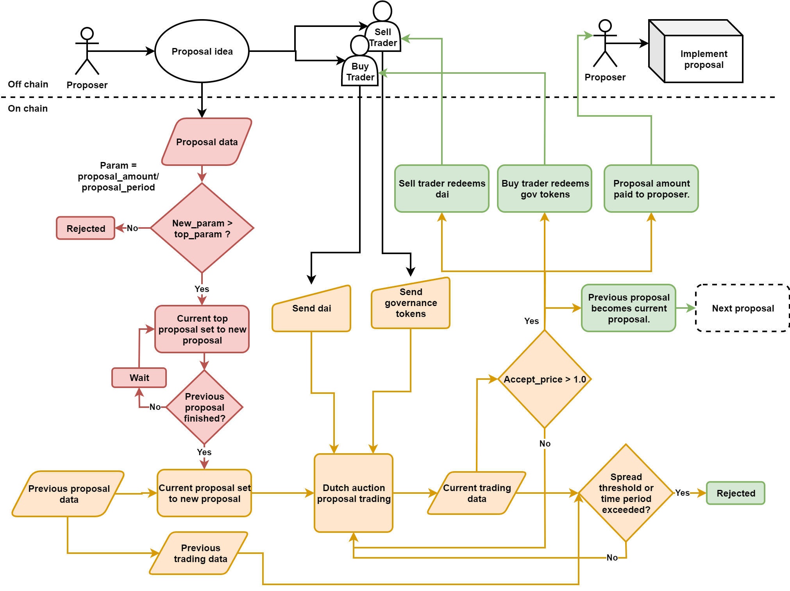

# Buidler_Governance
A governance mechanism for sustainably funding tokenised public goods.

[Medium article](https://medium.com/@b._/buidler-governance-a-solution-for-the-governance-and-funding-of-tokenised-public-goods-73c21b8067c7)  
[Telegram group](https://t.me/Buidler_Governance)  
[Rinkeby contract address](https://rinkeby.etherscan.io/address/0xaf439262Be9E6dD2C808a8464370621a553c4CB4): 0xaf439262Be9E6dD2C808a8464370621a553c4CB4  

# Contract interaction
This section will be updated further soon. For now, if more info is needed, see code comments in gov_v3.14.sol. 

- Users firstly need either the testnet erc20 WEENUS token or some testnet gov tokens.
- Users should `approve` the gov contract address to spend WEENUS if they want to `buy`, `close_tranche_buy` or `submit_proposal`.

## submit_proposal
"next" always refers to next proposal after this submitted one if the submitted one is successfully accepted.

"price", unless stated otherwise, always refers to [tokens trader receives]/[tokens trader gives] i.e. traders always want the price to be as high as possible no matter if they are trading on the `buy` or `sell` side of the auction. Similarly, price is always increasing on both sides of the auction.

`WAD` refers to the use of fixed point 18 decimals.

|name |type |description
|-----|-----|-----------
|_amount|uint256|Proposal amount requested by proposer (beneficiary). (WAD)
|_next_init_tranche_size|uint256|Size, in dai (or other external token), of the first tranche for the *next* proposal. (`WAD`)
|_next_init_price_data|uint256[4]|Array of price data for next proposal [initial buy price (`WAD`), initial sell price (`WAD`), base (`WAD`), exponent factor (int)] `price = wmul(price_data[_side], wpow(price_data[2], mul(price_data[3], sub(_now, current_tranche_start))/WAD))`
|_next_reject_spread_threshold|uint256|The spread threshold at which the next proposal can be rejected where spread = sell_price * buy_price (`WAD`)
|_next_minimum_sell_volume|uint256|The minimum total volume that must be traded on the sell and the buy side of the proposal for the next proposal to be accepted. (`WAD`)
|_prop_period|uint40|The amount of time after initialisation that may elapse and the proposal may still be accepted, otherwise it may be rejected i.e. after this time has elapsed. (int)
|_next_min_prop_period|uint40|Minimum `_prop_period` for the next proposal. (int)
|_reset_time_period|uint40|If there are no successfully submitted proposals for this time period, the `reset` function may be called to effectively reset the most recently accepted proposal data. (int)

# Future development
- Fontend website listing proposals and current proposal status with trading data.

- Uniswap market for gov tokens

- Uniswap type market for (redeemable/refundable) proposal tokens 

- Optimising contracts for gas costs. Some storage could be cut down in different ways.

